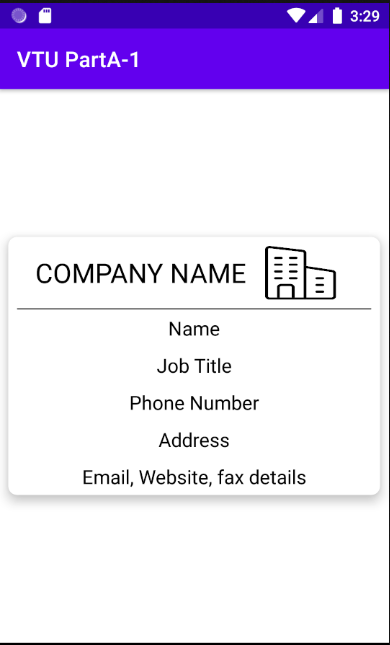

# MOBILE APPLICATION DEVELOPEMENT 

# Programme 1 (PartA-1)

Create an application to design a Visiting Card. The Visiting card should have a company logo at the
top right corner. The company name should be displayed in Capital letters, aligned to the center. information like the name of the employee, job title, phone number, address, email, fax and the website address is to be displayed. Insert a horizontal line between the job title and the phone number.

